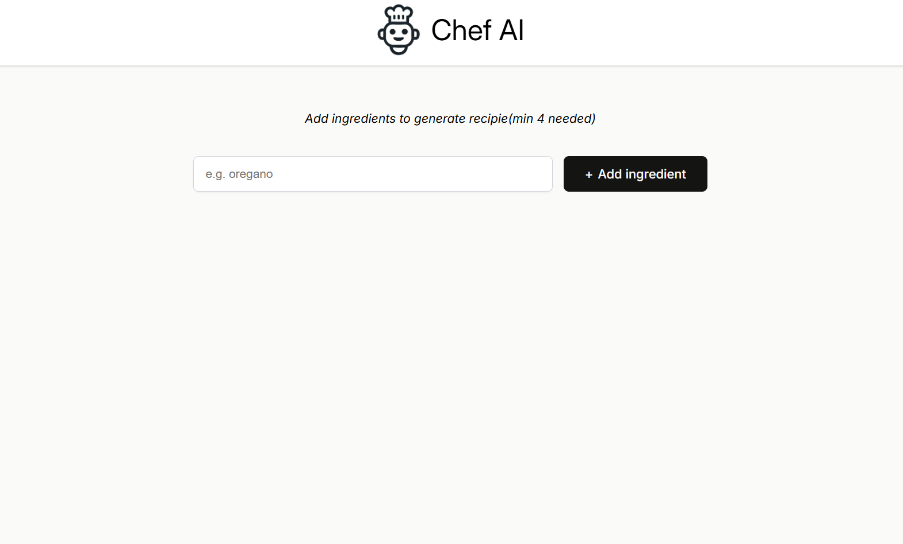

# Chef AI

**Chef AI** is a React-based web app that suggests recipes based on ingredients you have at home. It uses an OpenAI-powered API (via a Cloudflare Worker proxy) to generate creative, markdown-formatted recipe suggestions in real time.

---

## Features

* 🥗 **Ingredient Input:** Add a list of ingredients you have available.
* 🤖 **AI-Powered Recipes:** Instantly get a unique recipe suggestion, formatted for easy reading.
* ⚡ **Modern Stack:** Built with React and Vite for a fast, responsive UI.
* 🌐 **Markdown Rendering:** Recipes are returned and displayed in clean markdown.
* ⏳ **Loading Indicator:** See when your recipe is being generated.

---

## Demo

[Live Deployment](https://fabulous-salmiakki-0a69f5.netlify.app/)



---

## Getting Started

### Prerequisites

* [Node.js](https://nodejs.org/) (v18 or higher recommended)
* npm

### Installation

1. **Clone the repository:**

   ```bash
   git clone https://github.com/your-username/chef-ai.git
   cd chef-ai
   ```

2. **Install dependencies:**

   ```bash
   npm install
   ```

3. **Start the development server:**

   ```bash
   npm run dev
   ```

   Visit [http://localhost:5173/](http://localhost:5173/) in your browser.

---

## Project Structure

```text
/
├── components/
│   ├── ClaudeRecipe.jsx         # Renders the AI-generated recipe using markdown
│   ├── IngredientsList.jsx      # Displays the list of ingredients and recipe button
│   └── LoadingSvg.jsx           # Loading spinner component
├── images/
│   ├── chef-claude-icon.png     # App logo / screenshot
│   └── loader.svg               # Loader image
├── ai.js                        # AI logic (calls OpenAI API via proxy)
├── App.jsx                      # App root
├── Header.jsx                   # App header (logo/title)
├── Main.jsx                     # Main app logic (ingredients, recipe display)
├── index.jsx                    # Entry point
├── index.html                   # HTML template
├── index.css                    # Global styles
├── package.json
└── README.md
```

---

## How It Works

* **Ingredient input** is collected from the user in the main interface.
* The app sends your ingredients to an OpenAI-powered API (via a Cloudflare Worker proxy) using a POST request (see [`ai.js`](ai.js)).
* The AI responds with a markdown-formatted recipe, which is rendered in the app using `react-markdown`.
* A loading spinner is shown while the recipe is being generated.

---

## Customization

* **API Endpoint:** The OpenAI API endpoint is set in [`ai.js`](ai.js). You can swap this for your own backend or proxy if needed.
* **Prompts:** You can adjust how the prompt is constructed in [`ai.js`](ai.js) to change recipe style or instructions.

---

## Dependencies

* `react`
* `react-dom`
* `vite`
* `react-markdown`
* `openai` (for future extensibility)

---

## Security

* **API keys:** The app uses a proxy endpoint for API calls. No API keys are stored in the frontend code. For production, always secure your keys and move API calls to a backend server you control.

---

## License

MIT

---

*Questions, suggestions, or want to contribute? Open an issue or submit a pull request!*

---